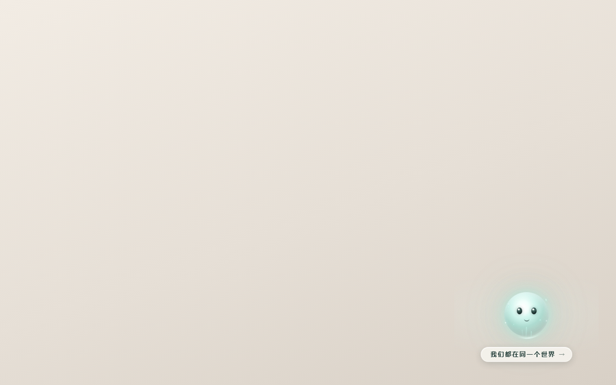

# 罗小黑战记 · DSH 启动封面

<p align="center">
  
</p>

<p align="center">
  
  
  
</p>

**DSH 桌面版客户端插件。** 启动应用、或者把窗口从托盘叫回来，先用一整幅水墨海报盖住界面；
**只有点右下角那只小能量精灵，才进得去。**

---

## 它不只是「一张启动图」

| | 细节 |
|---|---|
| 🌀 | **纸闪转场**：两张海报 12 秒一循环——定格 → 纸色一闪 → 换张 → 再闪回来。为什么不用叠化？两张海报的片名一个在左下、一个在左上，叠化会让两个「羅小黑戰記」同时半透明地叠在一起。纸闪把「两张同时可见」压缩成一个瞬间，而透出来的是海报自己的米白纸色，不是白屏 |
| ✨ | **整屏唯一入口**：热区只有右下角那只精灵（`我们都在同一个世界 →`）。点海报任何别的位置都没反应——不会手一抖就把封面碰掉 |
| 🪟 | **遮挡不误弹**：Chromium 会把「被别的窗口完全盖住」也报成 `document.hidden`，跟收进托盘在 API 上完全一样。这里用「**先失焦、又保持可见超过 120 ms、然后才隐藏**」把遮挡滤掉（启发式，见下文） |
| 🛟 | **坏掉也锁不死**：入口失灵还有 Esc、30 秒自动关、控制台开关三条退路；海报 404 就静态显示好着的那张；系统开了「减少动态效果」就自动不动 |

## 一个周期里发生了什么

| 时间 | 画面 |
|---|---|
| 0 – 2s | 定格 A，A 缓慢推近（scale 1.00 → 1.015） |
| 2 – 4s | A 淡出到全透明，同时推到 1.03 |
| 4 – 6s | B 从全透明淡入，从 1.03 收到 1.015；**4s 这一瞬两张图都是 0** |
| 6 – 8s | 定格 B，B 缓慢拉远（1.015 → 1.00） |
| 8 – 10s | B 淡出到全透明；**10s 这一瞬两张图都是 0** |
| 10 – 12s | A 淡入，回到起点——与 0s 完全一致，循环无缝 |

纸闪那两个瞬间，屏幕上只剩浮层自己的米白纸色渐变：



## 装它

**① 装进桌面版 profile**（桌面版 profile 硬编码为 `profiles/desktop`，官方 `dsh plugin` 命令不支持它，要用桌面版自带的 pnpm）：

```powershell
cd "$env:USERPROFILE\.dsh\profiles\desktop"
node "C:\Program Files\DeepSeek Harness\resources\runtime\pnpm\bin\pnpm.mjs" add "<本仓库路径>"
```

**② profile 的 `package.json` 里两处都要有**，缺一不加载：

```jsonc
{
  "dependencies": { "dsh-client-hei-poster": "file:<本仓库路径>" },
  "dsh": { "profile": { "bundles": [ "...", "dsh-client-hei-poster" ] } }
}
```

**③ 重启桌面版。**

> ⚠️ 桌面版**运行中会自己改写 profile 文件**，所以每次读写前重新读一遍，不要拿旧内容覆盖。

## 装上以后

**想关掉封面**（按顺序试）：

| 方式 | 做法 |
|---|---|
| 正常入口 | 点右下角小能量精灵 |
| 快捷键 | 按 `Esc` |
| 等 | 30 秒后自动关闭 |
| 本次会话 | `window.__HEI_POSTER_DISABLE__ = true` |
| 永久 | `localStorage.setItem("hei.noPoster", "1")`（恢复：`localStorage.removeItem("hei.noPoster")`） |
| DevTools | 给 `<html>` 加属性 `data-hei-off` |

**想确认插件真的加载了**（F12 → Console）：

```js
document.querySelector("#hei-poster-overlay")        // 应该返回一个 div
window.__HEI_POSTER__.motionMode                      // "animated" | "static"
window.__HEI_POSTER__.seekMotion(0.3333)              // 手动定帧到纸闪瞬间
window.__HEI_POSTER__.setRestoreOnReturn(false)       // 只在冷启动显示封面
```

`seekMotion()` 之后时间轴是暂停的（`motion.active === false`，但 `motionMode` 仍是 `"animated"`）；
封面下次出现会从相位 0 重新开始——每次都是新的一轮，这是预期行为。

**遮挡误弹了怎么办**：先看 Console 里那行诊断，它直接告诉你判据当时算成了什么——

```
[dsh-client-hei-poster] page hidden; blurDelta=35ms; focused=false; re-showOnReturn=true
```

`blurDelta=none` 说明隐藏前窗口一直聚焦 → 判为真实隐藏（托盘 / 最小化）；`blurDelta` 很大则是先失焦很久才隐藏 → 判为遮挡。
阈值在 `src/client/overlay.ts` 的 `OCCLUSION_BLUR_MS`（120 ms）。**这是启发式，不是保证**；
要彻底零误判就用 `setRestoreOnReturn(false)`，代价是失去「从托盘回来再显示」。

## 换掉里面的海报

直接覆盖 `assets/poster-a.png` 与 `assets/poster-b.png`（1536×1024），**不用改代码、不用重新构建**——
转场时间轴、循环、降级逻辑都按文件走。

<p>
  
  
</p>

仓库里这两张是 **AI 生成的示范素材**，换成你自己的图即可。

## 降级：任何一条命中都退回静态

| 条件 | 结果 |
|---|---|
| 系统开了 `prefers-reduced-motion: reduce` | 不出动画，静态显示本次轮换到的那张 |
| 任一海报没加载出来（404 / 解码失败） | 静态显示**好着的那张**，坏的那层隐藏——不留破图，也不留只剩纸色的空封面 |
| 图层不足两个 / 引擎内部异常 | 只 `console.warn` 一行并退回静态 |

另外动效是**静态先画**的：每次显示先用一开始就有的那一帧顶住，图片落定后再交给动效接管，所以从托盘回来不会闪白屏。

接管不是「等一次」，而是**每张海报的 `load` 事件各试一次**（`start()` 自己判断两张图是否都有像素）：
冷启动时两张图先后到达，先到的那张试不成，后到的那张完成接管 —— 所以第一次运行（缓存还是空的）也能动起来。

## 打包与发布（Release 里那个 zip 是怎么来的）

```bash
node scripts/pack-release.mjs            # 或者 npm run pack
```

产出 `dist/dsh-client-hei-poster-<版本>.zip`，**内容就是 `package.json` 的 `files` 白名单**——
和 pnpm 装进 profile 的东西逐字节一致（14 个文件）；解包后是一个同名顶层目录，不会把文件散进下载目录。

这个 zip 是**可复现**的：所有时间戳写死，同一棵树跑多少次都是同样的字节，所以发布说明里可以写 sha256 让人校验。

放进 Release（**GitHub Desktop 没有 Release 功能**，这一步只能用浏览器）：

```bash
git tag -a v0.2.0 -m "v0.2.0"
git push origin v0.2.0
```

1. 打开 `https://github.com/<你的用户名>/dsh-client-hei-poster/releases/new`
2. **Choose a tag** 选 `v0.2.0`；**Release title** 填 `v0.2.0`；说明里贴发布正文
3. 把 `dist/dsh-client-hei-poster-0.2.0.zip` **拖进 "Attach binaries by dropping them here"** 那个虚线框
4. 点 **Publish release**

核对：Assets 里除了 GitHub 自动生成的两个源码包（Source code (zip) / (tar.gz)），
**必须还能看到你上传的那个文件名**；只有自动的那两个，说明拖拽没生效。

## 自检

在仓库目录下：

```bash
node --check src/index.js                # 宿主半边语法
node --test src/client/overlay.test.ts   # 状态机 24 项 + 动效契约 8 项 = 32 项
node scripts/selfcheck-host.mjs          # 宿主路由 38 项（白名单 / Range / ETag / 路径逃逸）
node scripts/selfcheck-client.mjs        # 客户端 44 项，在真实无头浏览器里跑真产物
node scripts/selfcheck-slow-poster.mjs   # 冷启动回归 5 项：故意让一张海报慢 700ms
node scripts/build-client.mjs            # 重建 lib/client.js
```

无头浏览器由 `scripts/lib/browser.mjs` 选：**先自证能用再交出去**（跑一次 `about:blank` 看有没有输出），
顺序是 `HEI_BROWSER` → Chrome → Edge。
这不是洁癖：Edge 154（2026-09）会把请求转交给已在运行的实例，自己退出码 0、**一个字节都不输出**——
脚本要是不先验一下，那种「沉默」会被当成「没有失败」。

`selfcheck-client.mjs` 在内存里起一个静态服务，把 `/plugins/<id>/assets/` 映射到真实素材，
然后断言热区门禁（点海报不关、点入口才关）、轮换、武装延迟、禁用开关、Esc、teardown、零 `console.error`，
以及 6 项动效接线：`motionMode` 在图片落定后变成 `"animated"`、`seekMotion(0 / 0.3333 / 0.5 / 0.99)` 的定帧不透明度、
循环首尾一致、关闭封面后 `seekMotion` 不抛异常。

## 设计约束（不要动）

- 客户端半边 `export const inject = []`：只用 DOM，不读任何服务，从根上避开 "cannot get property X without inject"。
- 产物 `lib/client.js` 的 `require()` 清单为**空**——不依赖宿主任何外部模块。宿主只 seed 九个 react 相关条目
  （react / react/jsx-runtime / react-dom / react-dom/client / @deepseek-ai/cordis / dsh-client-store /
  dsh-client-ui-slots / dsh-client-ui-primitives / dsh-client-ui-dockkit），多一个 import 浏览器里就直接抛异常。
- 浮层挂在 `document.body` 下、`#root` 的同级兄弟，`z-index: 2000`（宿主最大 1100）。
- **绝不写 `<html>` 背景**：宿主主题已保证 body 不透明，而内联的 html 背景会在 macOS vibrancy 下把窗口刷黑且无法恢复。
- `apply()` 第一句就注册 `ctx.effect` teardown（可变 ref 后装实现），保证半成品也能被清理。
- 我们的 CSS 只注入 shadow root（动效引擎也只把自己那份 `<style>` 塞进 `.stage`），绝不进 `document.head`。
- 无任何第三方运行时依赖，不会遮蔽 profile 里 hoisted 的宿主依赖。

## 目录

```
src/index.js            宿主半边：白名单路由 + ETag/304 + Range/206/416 + 防路径逃逸
src/client/index.tsx    浏览器半边：浮层、状态机接线、动效接管、降级
src/client/overlay.ts   显示时机状态机（托盘恢复 vs 遮挡）· 有单测
src/client/motion.ts    12 秒循环转场引擎 · 零依赖
src/client/entry.ts     右下角「小能量精灵」入口
src/client/lines.ts     入口文案
lib/client.js           构建产物（window.__ModuleLoader__.load 包装，require 清单为空）
assets/poster-*.png     两张海报素材 1536×1024
docs/                   README 用的动效图与静图
scripts/pack-release.mjs 打包：按 files 白名单生成可复现的发布 zip
dist/                  打包产物（.gitignore，发 Release 时才上传）
```

## License

MIT